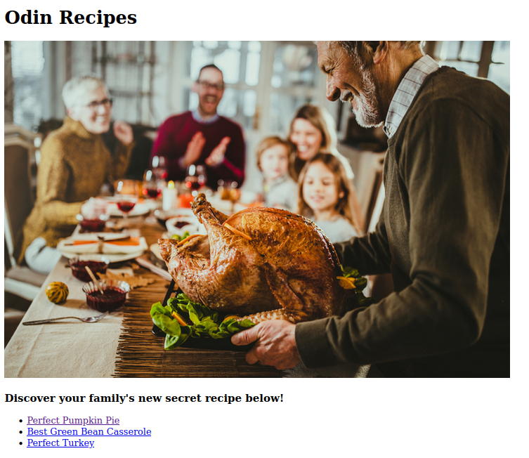
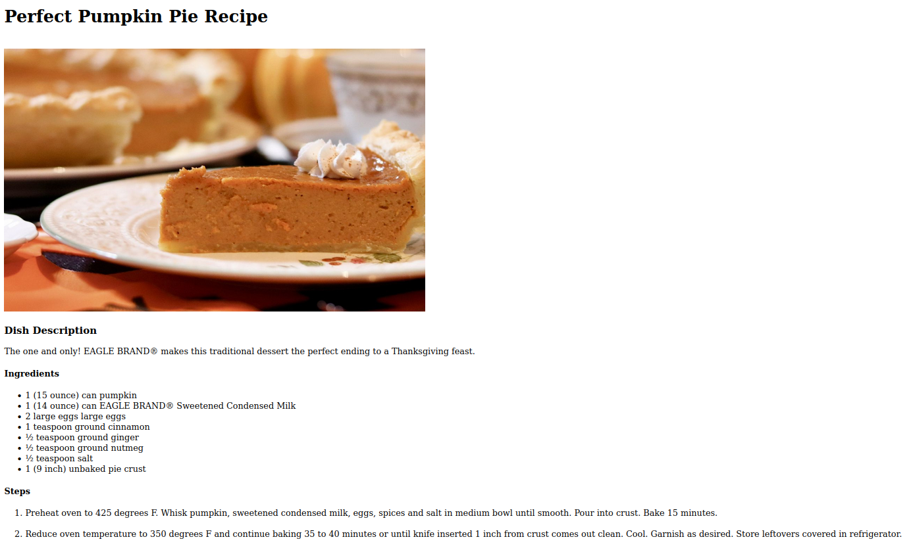

# odin-recipes
I am about to complete a webpage that acts as a recipe book.
I will practice making my boilerplate, making links, inserting images, and folder management.
I don't think it should take me too long, as most of this makes sense. However, you never know!

# HTML Recipes

This project aims to practice the basics of HTML.

### Functionality

* Manually create HTML boiler plate
* Created links to multiple recipes
* Inserted images
* Organized information in a readable way

### Screenshots

  <figure>
    <figcaption>Recipe Home Page</figcaption>
    
  </figure>
  <figure>
    <figcaption>Pumpkin Pie Recipe Page</figcaption>
    
  </figure>

